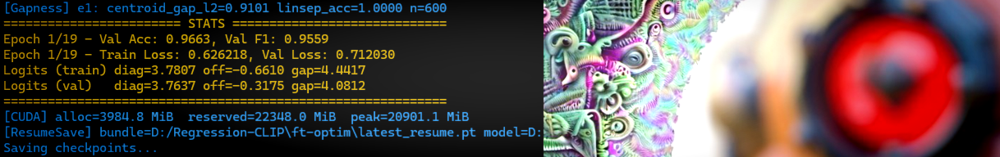
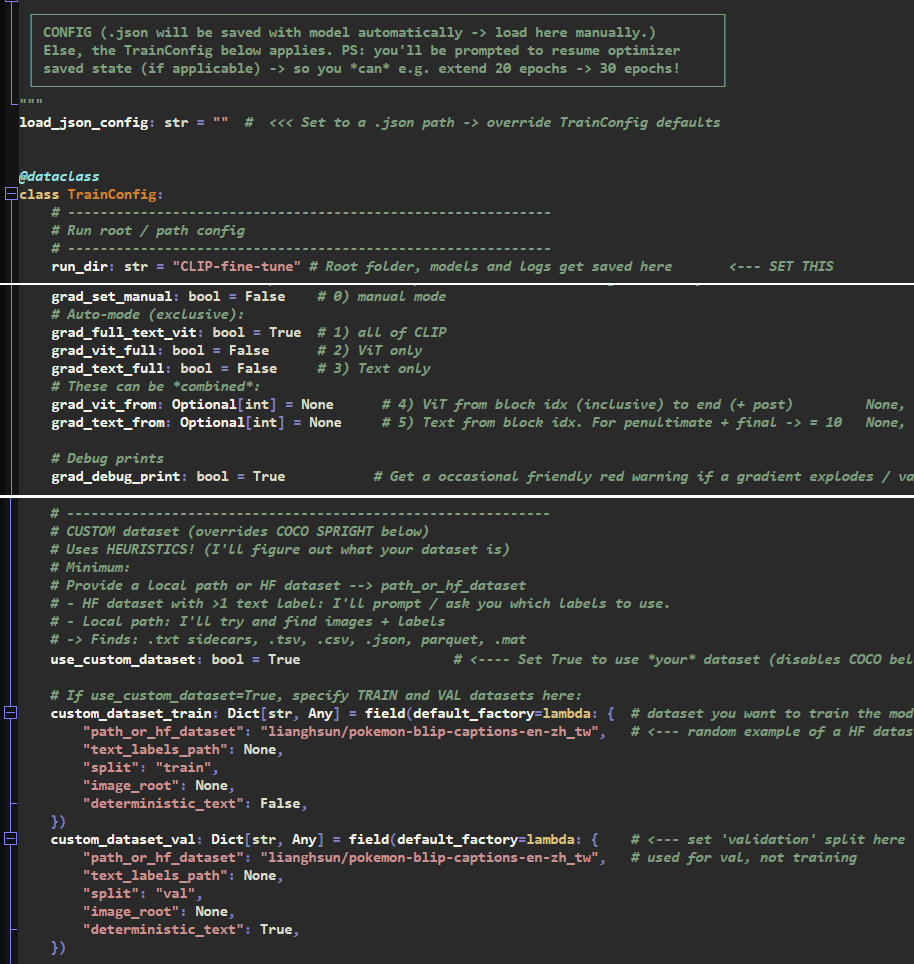
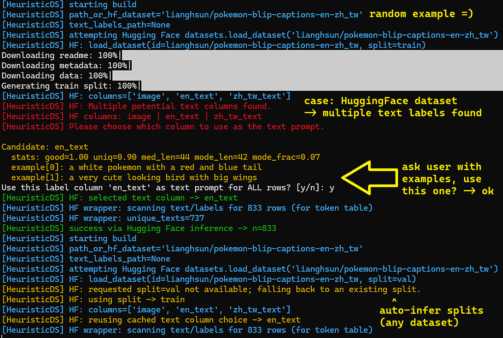
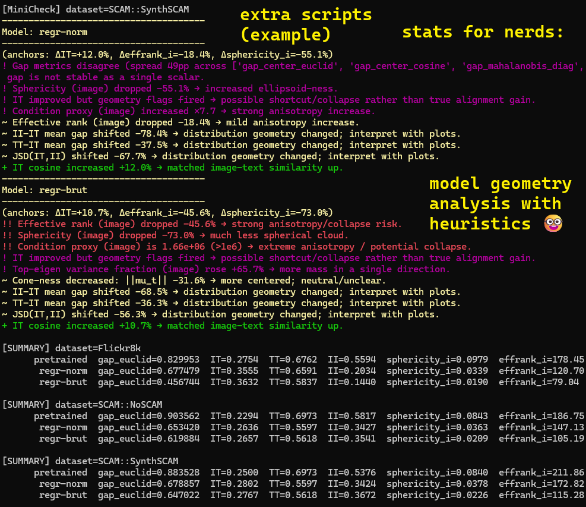

# 🎉 CLIP-fine-tune 2026 ! 🤖🫶🤓

------
📄 Paper: [Latent Crossroads Regression CLIP](docs_regression_clip/Latent-Crossroads-Regression-CLIP-paper-final.pdf)

📄 Latent Crossroads paper references: Click here!

The config .json are in `utils_xconfigs_examples` --- Training code: `all_in_one_clip_fine_tune.py` --- To reproduce main experiments: `eval_reproduce_*.py` --- Details can be found in the docstring at the top of every script

------
### New Regression-CLIP models:
- Balanced: [CLIP-Regression-ViT-L-14](https://huggingface.co/zer0int/CLIP-Regression-ViT-L-14) 🤗
- Brut: [CLIP-Regression-BRUT-ViT-L-14](https://huggingface.co/zer0int/CLIP-Regression-BRUT-ViT-L-14) 🤗
- All my CLIP models: [huggingface.co/zer0int](https://huggingface.co/zer0int) 🤗
------

### What's New in CLIP-fine-tune? 🎉
- All-in-one complete fine-tuning suite
- 'It basically fine-tunes itself' auto-mode 👶
- Just check `all_in_one_clip_fine_tune.py` for config & run!
- Super fast: Time slashed in half** (vs. my previous code)
- Includes NEW method: Regression-CLIP with Teachers
- Includes all my previous methods like KO-CLIP
- Read the NEW [Regression-CLIP paper](docs_regression_clip/Latent-Crossroads-Regression-CLIP-paper-final.pdf)
- Read the (previous) [KO-CLIP paper](docs_ko_clip/KO-CLIP-paper-final.pdf)

### Regression-CLIP in a nutshell: 🎯
- Enable for block 22, 23 (ViT-L/14) if:
- You have issues with CLIP misclassifying 'text in image'
- Well-known -> typographic attack vulnerability, e.g.:
- You have product photos with text labels on them
- You have comics with text in them, etc. ...

### Models & Datasets: 🗂️
- Supports HuggingFace models and Long-CLIP 248 tokens
- Loads any .safetensors, OpenAI pickle, or HF Hub CLIP
- Dataset heuristics: Config-free mode to figure out any of:
- Sidecar labels, txt, .csv, .tsv, .json, .mat, parquet
- You provide a root directory, I'll figure out the rest!
- HuggingFace datasets: Will prompt if >1 text column found.

### Code optimization, **speed: 👨🏻‍💻
- One-time process spawn (Windows) -> re-use for speed
- Efficient threading, persistent workers, prefetching
- Pretokenize -> Token table with IDs for fast reference
- See `utils_train` code & docstrings for all details
- Example (my): Windows, RTX 4090 -> was: ~1h -> is: 25 min / Epoch

### Quality of Life: 📈
- .json config auto-save, loading from .json config
- Includes optimizer state saving & continuing
- Includes EMA-Model support (kept in RAM, not VRAM)
- Presets for optimizer groups (and a manual params+lr mode)
- Automated ZS + LP + Typo Attack mini-benchmarks (train -> val)
- Logs & plots: VRAM / Epoch, gradient norms, loss, margins, ...

### Toolkit Suite: 🛟
- Rescue ('transplant') for single-Encoder collapsed embeddings
- Benchmark suite: typographic attack, zero-shot, retrieval
- Post-training logit_scale calibration
- Geometry analysis tools with heuristics:
- Report problematic geometry -> what & where for each Encoder
- E.g. rank of embeddings, sphericity, anisotropy, ...
- All scripts have docstrings with info / instructions at the top

### More
- View the old version (pre-2026) of CLIP-fine-tune here: [Previous version of CLIP-fine-tune](https://github.com/zer0int/CLIP-fine-tune/tree/CLIP-vision)

------

Love ❤️ this CLIP? 

ᐅ  [Buy me a coffee](https://ko-fi.com/zer0int) on Ko-Fi ☕

Or click here for address to send 🪙₿ BTC
 
3PscBrWYvrutXedLmvpcnQbE12Py8qLqMK

-------

Friendly config in `all_in_one_clip_fine_tune.py`:

Automatic dataset config of `as above`: Heuristics + ask user if multiple labels present:

Geometry analysis suite `eval_measure_modality_gap_geometry.py`; heuristics will inform about issues (e.g. 'did embeddings collapse?'):
