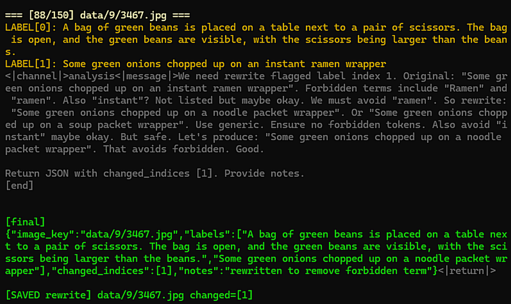

## De-textify datasets for CLIP

CLIP's 'text-reading obsession' aka typographic attack vulnerability comes from shortcut learning; InfoNCE contrastive loss can be reduced for perfect matches of text-in-image == text-in-label.\
We mitigate further encouraging this shortcut by avoiding labels that mention any word present in a given image.

------

Step 1: Run PaddleOCR and export captions where text-in-label == text-in-image matches found.
```
python ocr_clip_caption_text_export.py train-0_9.json
```
-> yields `*_dump_gpt_oss.json`
Step 2: Use GPT-OSS 20B to re-write the labels, avoiding flagged words:
```
python rewrite_clip_ocr_leaks_gptoss.py train-0_9_dump_gpt_oss.json
```
Verifies for absence of forbidden words in predicted label; flags errors for incomplete / still to-do.\
Allows cancel-and-continue (completed vs. to-do flags); see code docstring or use `--help` for details.\
See [zer0int/GPT-OSS-20B-Windows-16GB-RTX4090](https://github.com/zer0int/GPT-OSS-20B-Windows-16GB-RTX4090) for running GPT-OSS prerequisites.\
Step 3: GPT-OSS may sometimes fail to resolve a conflict in the labels. Extract remaining to-do:
```
python clip_ocr_rewrite_leftovers.py extract train-0_9_dump_gpt_oss.json
```
-> yields `*_leftovers_for_human.json`\ -> Give to SOTA LLM -> yields e.g. `*_manual_rewrites.json`\
```
python clip_ocr_rewrite_leftovers.py merge train-0_9_dump_gpt_oss.json --manual train-0_9_manual_rewrites.json`
```
-> yields `*_rewritten_labels.json`\
Step 4: Merge it back into a plain training dataset labels file:
```
python clip_ocr_merge_rewrites_to_labels.py train-0_9_dump_gpt_oss_rewritten_labels.json --output train-0_9_labels_gpt_oss.json
```
-> yields `train-0_9_labels_gpt_oss.json`\
Step 5: Tokenizer Test: GPT-OSS labels may exceed max tokens for CLIP.\
This script auto-truncated from the back to previous `,` or `.` until label < max tokens.\
Omit `--auto` to manually re-write labels (interactive).\
Use `--context-length 248` for Long-CLIP models.
```
python fix_clip_label_token_lengths.py train-0_9_labels_gpt_oss.json --auto
```
-> yields `*_truncated.json`

------

Example: GPT-OSS pondering 'ramen' word avoidance. :)
